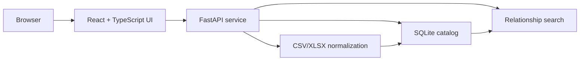

# Entity Map Project Guide

## 1. What Entity Map does

Entity Map is a local web application for exploring and maintaining field-level relationships between legacy data models and current data models. It replaces difficult-to-query mapping spreadsheets with a searchable catalog, a relationship view, and a current-first mapping workspace.

The application is designed for migration analysis, data lineage discovery, schema rationalization, and mapping-gap review. It supports multiple systems on both sides of a migration and identifies each model with a user-defined alias such as `CRM v1`, `Billing Archive`, `Customer API`, or `Enterprise Lakehouse`.

The main capabilities are:

- Import current and legacy field inventories from CSV or XLSX.
- Import existing paired legacy-to-current mapping files.
- Store normalized fields, mappings, metadata, provenance, and import history in SQLite.
- Search from either the legacy or current side.
- Filter results by model, table, mapping state, and source file.
- Preserve one-to-many and many-to-one mapping relationships.
- Display both legacy fields with no current target and current fields with no legacy source.
- Create missing legacy fields manually and persist new mappings.
- Export the normalized catalog as CSV.

Entity Map is a single-user local application in its current form. It has no authentication, multi-user approval workflow, or remote database dependency.

## 2. How the application is organized



The application has four main layers:

| Layer | Technology | Responsibility |
| --- | --- | --- |
| Frontend | React, TypeScript, Vite | Explorer, filters, relationship details, model-pair selection, mapping workspace, data-source drawer |
| API | FastAPI | File upload, catalog queries, field creation, mapping changes, export, static frontend serving |
| Data processing | pandas, openpyxl | CSV/XLSX parsing, header detection, validation, normalization, provenance capture |
| Persistence | SQLite | Models, fields, mappings, import history, and source references |

The production frontend bundle is generated into `src/entity_map/static` and is served by the same FastAPI process. Only one local service is required.

## 3. Catalog concepts

### Model aliases

A model alias identifies one logical schema inventory. A field is uniquely identified by:

```text
(model alias, table name, column name)
```

This means `CRM v1.CLIENT.ID` and `CRM v2.CLIENT.ID` remain separate fields even when their table and column names are identical.

Inventory imports have one alias. A paired mapping import has two aliases: one legacy alias and one current alias.

### Field metadata

Both legacy and current fields can store:

| Metadata | Required | Example |
| --- | --- | --- |
| Model alias | Yes | `CRM v1` |
| Database | No | `customer_warehouse` |
| Schema | No | `public` |
| Table | Yes | `CLIENT` |
| Column | Yes | `CLIENT_ID` |
| Description | No | `Unique client identifier` |
| Data type | No | `BIGINT` |

### Relationships

A relationship connects one legacy field to one current field. The catalog allows:

- One legacy field to map to multiple current fields.
- Multiple legacy fields to map to one current field.
- Repeated relationships from multiple files, while preserving each source reference.

### Provenance

Imported records retain the source filename, worksheet name, and original spreadsheet row number. Manual fields and mappings use a synthetic source reference indicating that they were created in the mapping workspace.

### Unmapped fields and current gaps

There are two distinct gap types:

| Gap | Meaning | How it appears |
| --- | --- | --- |
| Legacy unmapped | A legacy field has no current target | Amber row with `No current target` |
| Current unmapped | A current field has no legacy source | Amber row with `No legacy source` |

Current gaps can only be discovered when the complete current inventory has been imported. A paired mapping file cannot reveal a current field that never appears in that mapping file.

## 4. Local installation

### Prerequisites

- macOS, Linux, or Windows with a shell environment
- [uv](https://docs.astral.sh/uv/) installed
- Python 3.12 available through uv
- Node.js and npm only if you intend to modify or rebuild the frontend

The runtime supports Python 3.11 or newer; Python 3.12 is recommended and used by the development environment.

### Create the environment

From the repository root:

```bash
uv venv --python 3.12
source .venv/bin/activate
uv pip install -e ".[dev]"
```

On Windows PowerShell, activate with:

```powershell
.venv\Scripts\Activate.ps1
```

Confirm the installation:

```bash
python --version
entity-map --help
```

### Start the application

```bash
entity-map serve
```

The service binds to `127.0.0.1:8501` and normally opens the browser automatically. Binding to `127.0.0.1` keeps the application accessible only from the local machine.

To start without opening a browser:

```bash
entity-map serve --no-browser
```

To use another port:

```bash
entity-map serve --port 8600 --no-browser
```

The source-checkout launcher is equivalent:

```bash
python app.py
```

## 5. First-time setup and imports

Open **Data sources** in the top-right corner. Entity Map has three import paths.

### Import a current model

1. Enter a current model alias, for example `Customer API`.
2. Select **Current system**.
3. Upload one or more CSV/XLSX field inventories.
4. Review the imported and invalid row counts.

Importing the full current inventory is important because it establishes the benchmark and allows Entity Map to identify current fields with no legacy source.

### Import a legacy model

1. Enter a legacy model alias, for example `CRM v1`.
2. Select **Legacy systems**.
3. Upload one or more CSV/XLSX field inventories.
4. Review the result.

### Import existing mappings

1. Enter a pair such as `CRM v1 → Customer API`.
2. Select **Existing mappings**.
3. Upload one or more paired mapping files.
4. Review the result.

Imports merge into the saved catalog. You do not need to upload the same files each time the application starts.

## 6. Supported file formats

Entity Map accepts `.csv` and `.xlsx`. For XLSX files it scans all worksheets and detects a likely header row, including headers that do not begin on the first row.

### Inventory format

The minimum useful current or legacy inventory is:

```csv
Table Name,Column Name,Description
CUSTOMER,ID,Primary key of the customer
CUSTOMER,FULL_NAME,Customer full name
```

Richer metadata is supported:

```csv
Database,Schema,Table Name,Column Name,Description,Data Type
customer_db,core,CUSTOMER,ID,Primary key of the customer,BIGINT
customer_db,core,CUSTOMER,FULL_NAME,Customer full name,VARCHAR
```

Table and column are required. Description, database, schema, and data type may be blank.

### Paired mapping format

```csv
Legacy Table,Legacy Column,Legacy Description,Current Table,Current Column,Current Description
CLIENT,CLINETN_ID,Unique client identifier,CUSTOMER,ID,Primary key of the customer
CLIENT,CLIENT_NAME,Full name of the client,CUSTOMER,FULL_NAME,Customer full name
```

The full supported paired metadata set is:

```csv
Legacy Database,Legacy Schema,Legacy Table,Legacy Column,Legacy Description,Legacy Data Type,Current Database,Current Schema,Current Table,Current Column,Current Description,Current Data Type
```

Legacy table and column are required. Current table and current column must either both be populated or both be blank. Leaving both current identifiers blank creates a legacy-unmapped entry.

### Validation behavior

Entity Map skips invalid rows and reports their count. Common validation failures are:

- Missing table name.
- Missing column name.
- A mapping row with only one of current table/current column populated.
- Missing recognizable headers.
- Unsupported `.xls` files.

Save older `.xls` workbooks as `.xlsx` before uploading.

## 7. Using the explorer

### Choose the search direction

Use the **Legacy** and **Current** buttons beside the search box:

- **Legacy** answers: “Where does this legacy field live now?”
- **Current** answers: “Which legacy fields feed this current field?”

With no search text, the relationship table shows the catalog for the selected model filters.

### Search syntax

Search is case-insensitive and trims surrounding whitespace. It supports:

```text
COLUMN_NAME
TABLE_NAME.COLUMN_NAME
```

Exact matches rank before substring matches. Version one intentionally does not use fuzzy or AI matching.

Examples:

```text
CLINETN_ID
CLIENT.CLINETN_ID
CUSTOMER.ID
```

### Choose a model pair

Use the legacy and current model selectors above the relationship area. Selecting an existing pair displays its saved mappings plus relevant unmapped rows. The filters can further narrow the results by model, table, mapping state, or source file.

### Review gaps

Switch to **Legacy** scope to find legacy fields with no current target. Switch to **Current** scope to find current fields with no legacy source. Use the **Unmapped** filter to show only gaps.

Unmapped rows are highlighted amber. Selecting one opens its metadata and provenance in the detail panel.

### Read the summary

The explorer summary includes:

| Metric | Meaning |
| --- | --- |
| All legacy | Distinct legacy fields in the selected scope |
| Matched | Legacy fields with at least one current target |
| Coverage % | Matched legacy fields divided by all legacy fields |
| Unmapped | Legacy fields with no current target |
| Current gaps | Current fields with no legacy source |

When both model aliases are selected, the summary is calculated for that pair.

## 8. Creating and changing mappings

Open **Map fields**. This workspace treats the current model as the benchmark.

1. Choose the current model alias.
2. Choose the legacy model alias.
3. Search for a current table or field.
4. Open **Find legacy field** inside the current-field card.
5. Search the selected legacy inventory.
6. Select a legacy field to save the relationship.

To remove a relationship, use the unlink button beside an assigned legacy field.

### Create a missing legacy field

If a legacy search returns no result:

1. Select **Create and save legacy field**.
2. Enter database, schema, table, column, description, and data type.
3. Select **Save and map**.

Table and column are required. The new field and its relationship are immediately persisted in SQLite.

## 9. Persistence, export, and backup

By default, the database is stored at:

```text
~/.entity-map/catalog.db
```

Use another location by setting `ENTITY_MAP_DB_PATH` before launch:

```bash
ENTITY_MAP_DB_PATH=/absolute/path/entity-map.db entity-map serve
```

Uploaded workbook bytes are not retained. The normalized field metadata, relationships, import history, and provenance references are stored.

Use **Export catalog** in Data sources to download a normalized CSV backup. The export includes model aliases, field metadata, relationship rows, and provenance fields.

The **Clear** action removes fields, mappings, provenance, and import history from the active local database. Export first if the data may be needed later.

## 10. Common operations and troubleshooting

### Port 8501 is already in use

This usually means Entity Map is already running. First open:

```text
http://127.0.0.1:8501
```

Find the process on macOS or Linux:

```bash
lsof -nP -iTCP:8501 -sTCP:LISTEN
```

Stop the exact reported PID, then restart:

```bash
kill <PID>
entity-map serve
```

Or leave it running and use a different port:

```bash
entity-map serve --port 8600 --no-browser
```

### Current unmapped fields do not appear

Import the complete current model inventory under the intended current-model alias. Existing mapping files alone do not contain enough information to identify current fields absent from every relationship.

### A mapped field cannot be found

- Confirm the Legacy/Current search direction.
- Confirm both model aliases.
- Try the column name without the table qualifier.
- Clear table and mapping-state filters.
- Confirm that the source import appears in Recent imports.

### The frontend build is missing

From `frontend/`:

```bash
npm install
npm run build
```

Then restart the Python service.

### Database location or permissions are wrong

Set `ENTITY_MAP_DB_PATH` to a writable absolute path. The application creates the parent directory and database when possible.

## 11. Development workflow

### Backend tests

From the repository root:

```bash
uv run --no-sync pytest
```

The suite covers CSV/XLSX parsing, non-first-row headers, normalization, validation, provenance, duplicate grouping, search behavior, model aliases, manual mappings, persistence, unmapped fields on both sides, and API smoke behavior.

### Frontend build

```bash
cd frontend
npm install
npm run build
```

The compiled assets are written to `src/entity_map/static` and are packaged with the Python application.

### Frontend development server

Start the API:

```bash
entity-map serve --no-browser
```

In another terminal:

```bash
cd frontend
npm run dev
```

Vite proxies `/api` requests to the FastAPI service during development.

### Clean-environment installation check

To verify the distributable package independently of the existing virtual environment:

```bash
uv venv --python 3.12 /tmp/entity-map-verify
source /tmp/entity-map-verify/bin/activate
uv pip install .
entity-map --help
```

## 12. API reference

Interactive OpenAPI documentation is available while the service is running:

```text
http://127.0.0.1:8501/api/docs
```

Primary endpoints:

| Method | Path | Purpose |
| --- | --- | --- |
| GET | `/api/health` | Service health check |
| GET | `/api/catalog/summary` | Global or model-pair summary |
| GET | `/api/catalog/filters` | Available explorer filters |
| GET | `/api/catalog/search` | Legacy/current relationship search |
| GET | `/api/catalog/relationships/{id}` | Relationship metadata and provenance |
| GET | `/api/catalog/imports` | Recent import history |
| GET | `/api/catalog/download` | Normalized CSV export |
| POST | `/api/import/current` | Import a current inventory |
| POST | `/api/import/legacy` | Import a legacy inventory |
| POST | `/api/import/mappings` | Import paired mappings |
| GET | `/api/current-fields` | Current-first mapping candidates |
| GET | `/api/legacy-fields` | Search legacy mapping candidates |
| POST | `/api/fields` | Create a manual field |
| POST | `/api/mappings` | Create a mapping |
| DELETE | `/api/mappings/{id}` | Remove a mapping |
| DELETE | `/api/catalog` | Clear the active catalog |

## 13. Current scope and limitations

The current release intentionally keeps deployment lightweight:

- Local SQLite persistence only.
- One trusted local user.
- No authentication or authorization.
- No mapping approval workflow.
- No concurrent editing guarantees.
- No `.xls` support.
- No database connector or automatic schema crawl.
- No fuzzy, semantic, or AI-based field matching.
- No automatic current-field creation from a current-only row in a paired mapping format; current inventories are imported separately.

These boundaries keep the application easy to install and safe for local mapping analysis while leaving a clear path for future shared deployment, authentication, database connectors, and governance workflows.
